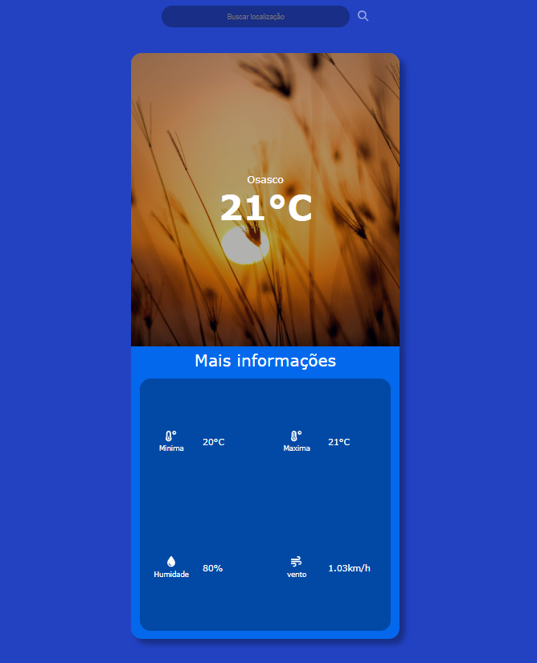

# WeatherApp

## 📸 Preview

- A clean and responsive Angular application that shows real-time weather information for any city using the OpenWeather API.
- Easily check current conditions, temperature, humidity, and forecasts with a simple interface.



## 🚀 Technologies Used

- Angular 16 — Main framework

- TypeScript — Core language

- HTML5 / CSS3 — UI structure and styling

- OpenWeather API (or another API used) — Source for weather data

## 💻 Running the Project Locally

- Clone the repository

```
git clone https://github.com/your-username/weather-app.git
cd weather-app
```

- Install dependencies

```
npm install
```

- Start the development server

```
ng serve
```
